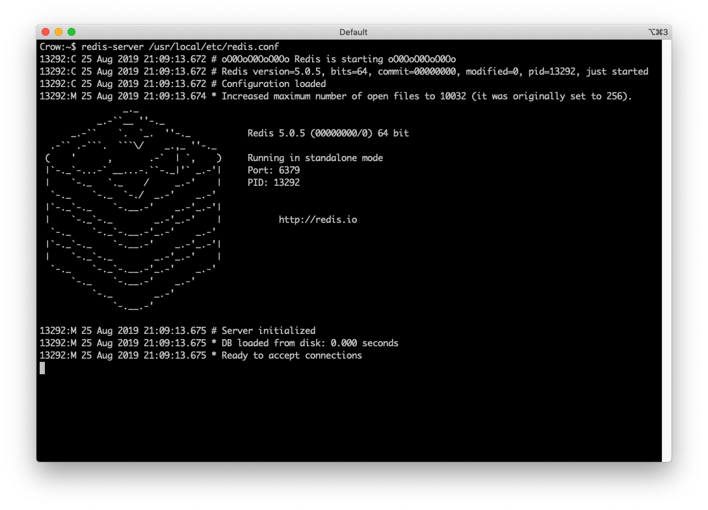
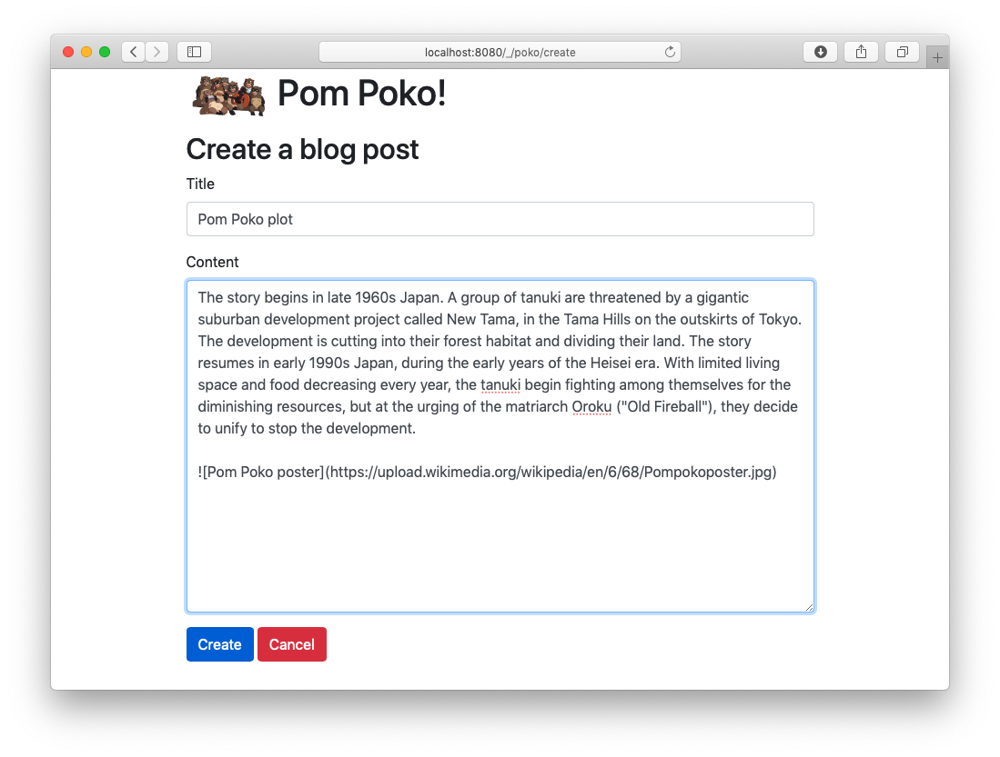
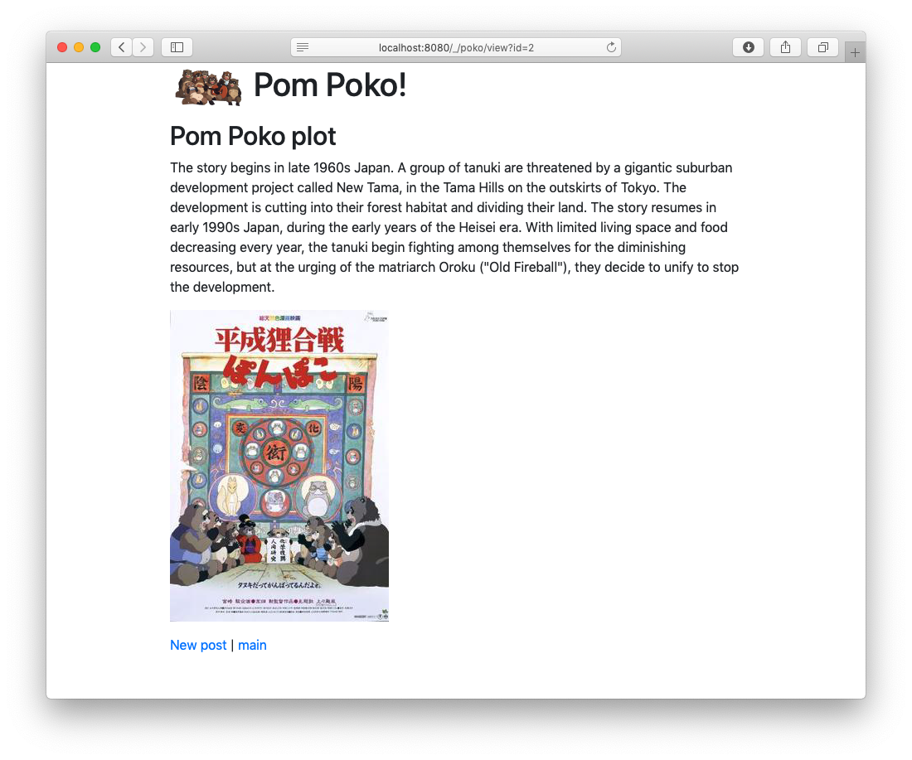
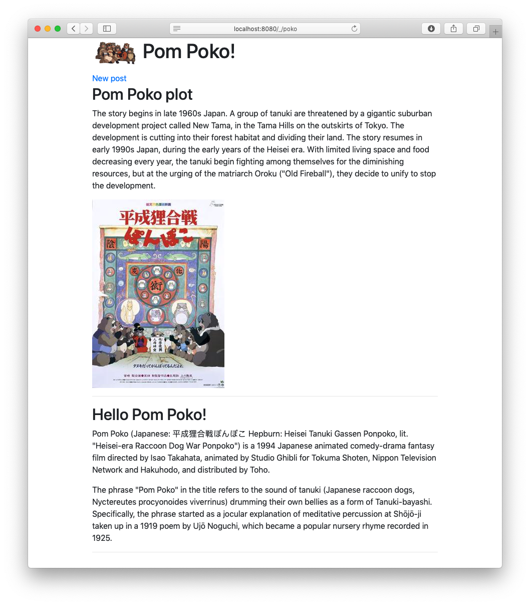

# Pom Poko

This is a sample project created using [Tanuki](https://github.com/sausheong/tanuki). The name Pom Poko refers to a [Studio Ghibli movie of the same title](https://en.wikipedia.org/wiki/Pom_Poko) which main characters are all tanukis.


This project shows how a simple blog web app can be created using Tanuki. The main features of the blog are:

1. View all posts
2. View a single post
3. Create a post

The blog storage is in [Redis](https://redis.io). It's assumed that you have already set up a Redis server somewhere, with default configurations.

Start the server from the command line:

```
redis-server /usr/local/etc/redis.conf
```



If you're setting things up differently just change the code accordingly.

## Handlers

There are 4 actions for the 3 capabilities of the blog, in 3 handler files.

```yaml
--- # handlers
# shows all blog posts
# uses a Python listener
- method : get
  route  : /_/poko
  type   : listener
  local  : true
  path   : handlers/main

# show the create page
- method : get
  route  : /_/poko/create
  type   : bin
  path   : handlers/create

# creates the post
# it is using the same handler as the create page
- method : post
  route  : /_/poko/create
  type   : bin
  path   : handlers/create

# view a single post
- method : get
  route  : /_/poko/view
  type   : bin
  path   : handlers/view
```

## Create a post

The create post action is a Ruby script that allows you to create a blog post.

```ruby
#!/usr/bin/env ruby

require 'json'
require 'redis'

# get the request from Tanuki
request = JSON.parse ARGV[0]

response = {
    status: 200,
    header: {},
    body: ""
}

# create a post
def create(post) 
    redis = Redis.new
    # the id is incremented from the key uuid
    id = redis.incr "uuid"
    redis.set(id, post.to_json)
    return id
end

case request["Method"]
# when the request is a GET
when "GET"
    response["body"] = DATA.read
# when the request is a POST
when "POST"
    # create the post as a hash
    post = {
        title: request['Params']['title'][0],
        content: request['Params']['content'][0]
    }
    # create the post in redis and get the id
    id = create post

    # redirect the user to the view action with the given id
    response['status'] = 301
    response['header'] = {
        Location: ["/_/poko/view?id=#{id}"]
    }
else
    response["status"] = 500
    response["body"] = "No such request"
end
# send the response to Tanuki
puts response.to_json

__END__
<!DOCTYPE html>
<html>
  <head>
    <title>Pom Poko Blog</title>
    <link rel="stylesheet" href="https://stackpath.bootstrapcdn.com/bootstrap/4.3.1/css/bootstrap.min.css" integrity="sha384-ggOyR0iXCbMQv3Xipma34MD+dH/1fQ784/j6cY/iJTQUOhcWr7x9JvoRxT2MZw1T" crossorigin="anonymous">
  </head>
  <body>
    <form action="/_/poko/create" method="post">
        <div class="container">
            <h1> Pom Poko!</h1>
            <h2>Create a blog post</h2>
            <div class="form-group">
                <label for="title">Title</label>
                <input type="text" class="form-control" name="title" id="title" required>
            </div>
            <div class="form-group">            
                <label for="content">Content</label>
                <textarea class="form-control" name="content" id="content" rows="6"></textarea>
            </div>
            <button type="submit" class="btn btn-primary">Create</button>
            <a href="/_/poko" class="btn btn-danger">Cancel</a>
        </div>
    </form>
  </body>
</html>
```

The GET request will give you the action of displaying the create form. The form itself is after the `__END__` Ruby keyword. Anything after `__END__` is not considered code by the Ruby interpreter and can be accessed using the special filenhandle `DATA`. This is simple trick that allows us to reduce the number of files.



The POST request will create the post, add it to Redis and redirect the user to the view post action.

## View a post

Once a post is create, the user is redirected to the view post action. This is also a Ruby script, which simply reads from Redis and displays the post. As before, the template is after the `__END__` keyword.

```ruby
#!/usr/bin/env ruby

require 'json'
require 'redis'
require 'redcarpet'

# get request from Tanuki
request = JSON.parse ARGV[0]
markdown = Redcarpet::Markdown.new(Redcarpet::Render::HTML.new(render_options = {}))

#  get the id from the parameter
id = request['Params']['id'][0]
# use the id to get the correct post
redis = Redis.new
post = JSON.parse redis.get(id)

# render the template and create the response
response = {
    status: 200,
    header: {},
    body: DATA.read % [post['title'], markdown.render(post['content'])]
}
# send response back to Tanuki
puts response.to_json 

__END__
<!DOCTYPE html>
<html>
  <head>
    <title>Pom Poko Blog</title>
    <link rel="stylesheet" href="https://stackpath.bootstrapcdn.com/bootstrap/4.3.1/css/bootstrap.min.css" integrity="sha384-ggOyR0iXCbMQv3Xipma34MD+dH/1fQ784/j6cY/iJTQUOhcWr7x9JvoRxT2MZw1T" crossorigin="anonymous">
  </head>
  <body>
        <div class="container">
        <h1> Pom Poko!</h1>
            <h2>%s</h2>
            <div>
                %s
            </div>
            <a href="/_/poko/create">New post</a> | <a href="/_/poko">main</a>
        </div>

  </body>
</html>
```



## View all posts

Finally, the view all posts action retrieves all posts from Redis and shows it. The view all posts action is a local Python listener.

```python
#!/usr/bin/env python

import socket
import sys
import json
import redis
from mako.template import Template

HOST = '0.0.0.0'
PORT = sys.argv[1]

with socket.socket(socket.AF_INET, socket.SOCK_STREAM) as s:
    r = redis.Redis(host=HOST, port=6379, db=0)
    s.bind((HOST, int(PORT)))
    s.listen()    
    while True:
        conn, addr = s.accept()
        with conn:
            # get request from Tanuki
            data = conn.recv(1024)
            # get template from file
            t = Template(filename="handlers/main.mako")
            # a list of posts to be retrieved from redis 
            posts = []
            # populate the list from redis
            keys = sorted(r.keys("*"), reverse=True)
            for k in keys:
                if k != b'uuid':
                    posts.append(json.loads(r.get(k)))
            # render the template, passing it the posts and create a reponse
            response = {
                'status': 200,
                'header': {},
                'body': t.render(posts=posts)
            }
            # send the response back to Tanuki
            conn.sendall(str.encode(json.dumps(response) + "\n", 'utf-8' ))
```

It uses [Mako](https://www.makotemplates.org) for templating and we have a separate template file named `main.mako`.

```html
<%!
    from markdown import markdown
%>
<!DOCTYPE html>
<html>
  <head>
    <title>Pom Poko Blog</title>
    <link rel="stylesheet" href="https://stackpath.bootstrapcdn.com/bootstrap/4.3.1/css/bootstrap.min.css" integrity="sha384-ggOyR0iXCbMQv3Xipma34MD+dH/1fQ784/j6cY/iJTQUOhcWr7x9JvoRxT2MZw1T" crossorigin="anonymous">
  </head>
  <body>
        <div class="container">
            <h1> Pom Poko!</h1>
            <a href="/_/poko/create">New post</a>
            % for post in posts:
            <h2>${post['title']}</h2>
            <div>
                ${markdown(post['content'])}
            </div>
            <hr/>
            % endfor            
        </div>
  </body>
</html>
```



## Summary

This is a very simple sample web app and lacks many capabilities and is used to show how a Tanuki app can be written. Feel free to change them, add new handlers or use different languages!
